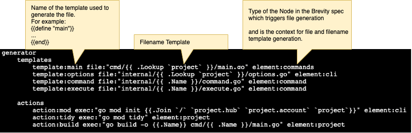

# Brevity

Brevity is an Code-Generator that can be used for any target software language.  Brevity is written in Go and uses the Go text/template engine to generate source code.  Libraries of code templates are used to compose a sophisticated application using only a specification.  The generated code is defined in layers to create the starting point for custom code development at many levels of abstraction: cli-only, cli plus web api, etc.

Brevity generates project code files and executes init commands to define an application.  The project specification is metadata written in the [brief](https://github.com/robbyriverside/brief) specification language which is syntax simplified XML.

The contents of files are defined using Go text-templates.  The generated files are allowed to be any format, even script files that can be later executed as an init command.  Further, Brevity is a meta-generator because it can generate template files or even [brief](https://github.com/robbyriverside/brief) files which can then be used for code generation.

## brevity command

The brevity command below will generate a working sample project using the "github.com/jessevdk/go-flags" package for command-line processing. The resulting "github.com/example/sample" project is generated under the output folder.

```bash
> brevity generate spec.brief output/
```

Contents of spec.brief:

```brief
brevity 
    project:sample  hub:"github.com"  account:example
        cli:"go-flags"
            commands
                command:exec desc:"execute command" short:"execute me"
                    args
                        // arg and option will take any key value accepted by go-flags
                        arg:Foo type:string description:"foo argument" env:FOO
                        arg:Bar type:int description:"bar argument" env:BAR
                    options
                        option:Verbose long:verbose type:bool description:"print verbose" short:"v"
                command:describe desc:"describe command" short:"describe me"
```

The above brevity spec produces a working project called sample with two commands: exec & describe.

## Generator

The generator for cli is found in the library folder.  The library is specified using the --lib argument and defaults to the BREVITY_LIB environment variable.  Four template files and a generator.brief spec defines the generator.

Contents of cli/generator.brief:

```brief
generator
    templates
        template:main file:"cmd/{{ .Lookup `project` }}/main.go" element:commands
        template:options file:"internal/{{ .Lookup `project` }}/options.go" element:cli
        template:command file:"internal/{{ .Name }}/command.go" element:command
        template:execute file:"internal/{{ .Name }}/execute.go" element:command

    actions
        action:mod exec:"go mod init {{.Join `/` `project.hub` `project.account` `project`}}" element:cli
        action:tidy exec:"go mod tidy" element:project
        action:build exec:"go build -o {{.Name}} cmd/{{ .Name }}/main.go" element:project
```

After all the files are generated using templates, actions are called to create the go.mod file, get the go-flags package and finally build the executable.  Full details are found in the [go-brevity package](https://github.com/robbyriverside/go-brevity).

### Generator Procedure

The generator walks the user written brevity spec.  This can contain multiple projects, each with its own package name, hub and account.  Inside a project are sections which specify each kind of generator, notice the spec.brief file above calls the cli generator using the go-flags option.

Each section loads the generator spec and template files.  Template generation and actions are triggered when as the generator walks the brevity spec.  As each element is encountered, during the walk, that node is applied to the templates that match the element key.  



When the walker returns to this element after walking its sub-elements, the actions are triggered.  This ensures all template file generation is complete before the actions are executed.  All actions are triggered in the base directory of the generated project.

__This page under construction__
